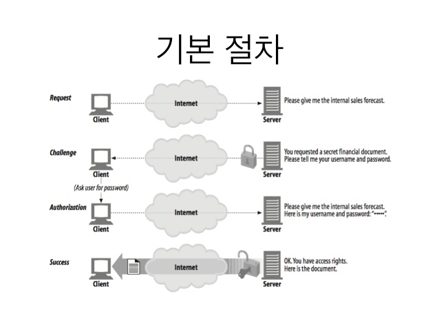
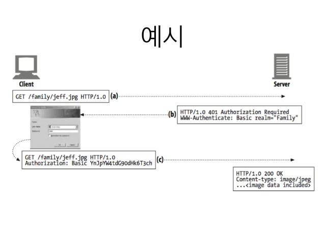
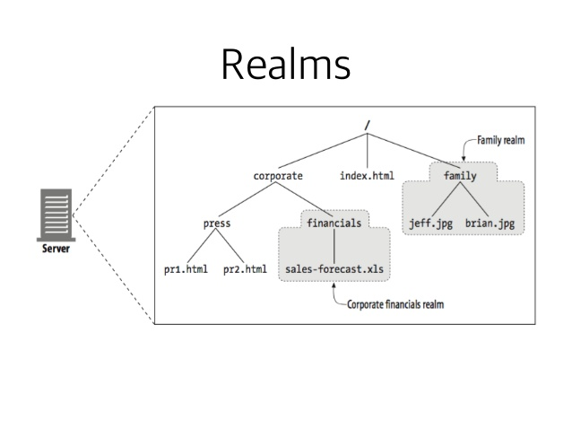

# 12장 기본 인증

일부 정보는 허가된 사람만이 데이터에 접근하고 처리할 수 있어야한다. 그러기 위해서는 서버가 사용자를 식별할 수 있어야한다.
**인증**은 당신이 누구인지 증명하는 것이다.

## 12.1 인증

누구인지 증명하는것, 자신에 대한 데이터는 신분을 판단하는데 도움이 된다.

### 12.1.1 HTTP의 인증요구/응답 프레임워크

HTTP는 사용자 인증을 하는 데 자체 인증요구/응답 프레임워크를 제공한다.

 

 서버는 요청을 처리하는 대신, 현재 사용자를 알기위해 개인 정보를 요구하는 '인증 요구'로 응답 한다.

### 12.1.2 인증 프로토콜과 헤더

* 다른 인증 프로토콜에 맞추어 확장할 수 있는 프레임워크를 제공한다.
* 헤더의 형식과 내용은 인증 프로토콜에 따라 달라진다.
* HTTP에는 기본 인증과 다이제스트 두가지 공식 인증 프로토콜이 있다.

|단계|헤더|설명|메서드/상태|
|:---:|:---:|:---:|:---:|
|요청||첫 번쨰 요청|GET|
|인증 요구|WWW-Authenticate|요청자에게 이름과 비밀번호를 제공하라는 응답 WWW-Authenticate 인증 영역과 방법을 나타냄|401 Unauthorized|
|인증|Authorization|인증 알고리즘과 사용자 이름,비밀번호를 기술한 Authorization 헤더를 함께 보낸다.|GET|
|성공|Authenication-info|인증 정보가 정확하다면 문서와 함께 응답한다. Authenication-info 헤더에 추가 정보를 기술하기도 한다.|200 OK|

 

 ### 12.1.3 보안 영역

 * HTTP는 각 리소스마다 다른 접근 조건을 가질 수 있다.
 * 401 서버 응답의 WWW-Authenicate 헤더의 realm 지시자가 보안영역을 나타낸다.

 > HTTP/1.0 401 Unauthorized  WWW-Authenticate: Basic realm="Corporate Financials"

 

 ## 12.2 기본 인증

 * RFC 2617

 ### 12.2.2 Base-64 사용자 이름/비밀번호 인코딩

 * HTTP 기본인증은 이름:비밀번호 에 base-64 인코딩을 한다.
 
 ### 12.2.3 프락시 인증

* 서버에 접근하기 전에 프락시 서버를 거치게 하여 접근 정책을 중앙 관리 한다.
* 통합적인 접근 제어를 하기 좋다.
* 웹 서버 인증과 헤더와 상태코드가 다르고 절차는 같다.

|웹 서버|프락시 서버|
|:---:|:---:|
|비인증 상태 코드: 401|비인증 상태 코드: 407|
|WWW-Authenticate|Proxy-Authenticate|
|Authorization|Proxy-Authorization|
|Authentication-Info|Proxy-Authentication-Info|

# 12.3 기본 인증의 보안 결함

1. 사용자 이름과 비밀번호는 쉽게 디코딩할 수 있다.
2. 복잡한방법으로 인코딩되어 있다해도 정보를 캡처하고 원서버에 요청해 인증을 성공할 수 있다.
3. 2차 보안 결함으로 이어질 수있다. (기본 인증에서 얻은 이름:비밀번호를 다른곳에서도 사용할 경우)
4. 프락시나 중개자가 개입하는 경우 정상적인 인증 동작을 보장하지 못한다.
5. 가짜 서버의 위장에 취약하다.